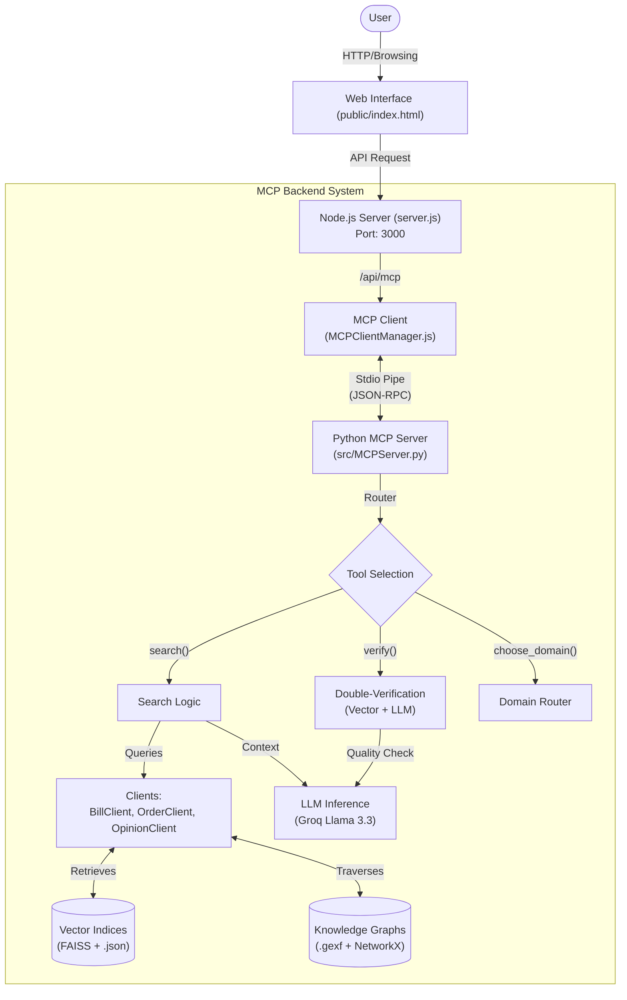
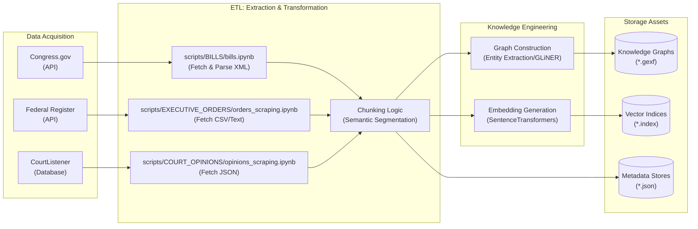

# Veritas: Civic Intelligence Engine

Veritas is a **Civic Intelligence Engine** designed to bridge the gap between complex legal documents and the public. Unlike standard chatbots that hallucinate, Veritas uses a strict **Retrieval-Augmented Generation (RAG)** architecture with a unique **Double-Verification Protocol** to ensure every answer is grounded in US statutes, orders, or case law. It operates as a stateless educational tool, prioritizing **verification**, **transparency**, and **privacy**.

Built on the **Model Context Protocol (MCP)**, Veritas integrates a unified Python retrieval backend with a modern web interface, allowing users to query Congressional Bills, Executive Orders, Supreme Court Decisions, and related News Articles through a single intuitive search engine.

## Features

-   **Multi-Domain Retrieval**: Seamlessly indexes and searches across four critical data sources:
    -   Congressional Bills
    -   Executive Orders
    -   Supreme Court Decisions
    -   Contextual News Articles
-   **Semantic Intelligence**: Utilizes advanced `SentenceTransformer` embeddings to understand the *meaning* behind queries, ensuring high-quality retrieval beyond simple keyword matching.
-   **Interactive Citations**: Citations in the AI response (e.g., `[1]`) are fully interactive. Hovering or clicking reveals a detailed tooltip with the source title, relevant metadata, and a snippet of the text.
-   **Thinking Process Visualization**: The UI visualizes the AI's cognitive steps in real-time ("Analyzing query...", "Retrieving documents...", "Verifying..."), providing transparency into the system's logic.
-   **Search Retrieval Settings**: A granular settings panel allows users to toggle specific data domains and adjust the number of documents retrieved for each source type.
-   **User Feedback Loop**: Integrated thumbs-up/down feedback mechanism allows users to rate responses, helping to build a dataset for future fine-tuning (RLHF).
-   **RAG Architecture**: Retrieves the most relevant legal chunks and feeds them into a Large Language Model (Llama 3.3 via Groq) to generate grounded, citation-backed responses.
-   **Graph RAG**: Enhances retrieval precision by traversing domain-specific **Knowledge Graphs** (using GLiNER for entity recognition) to prioritize document chunks that share relevant entities with the user's query.
-   **Verification Guardrails**: Implements a robust verification system using both vector similarity thresholds and a secondary LLM verification step to ensure relevance and reduce hallucinations.
-   **MCP-First Design**: Leveraging the Model Context Protocol allows for modular tool exposure, easy extensibility, and standardized client-server communication.

## Privacy & Ethics (SOPPA & AI Bill of Rights)

Veritas is designed with **Safety First** principles, aligning with the **UNESCO Recommendation on the Ethics of AI** and the **Blueprint for an AI Bill of Rights**:

*   **Stateless by Design**: We do not store conversation history or personal data (PII) on our servers, ensuring compliance with **SOPPA (Student Online Personal Protection Act)** strict standards for educational tools.
*   **Client-Side PII Guardrails**: The frontend proactively scans queries for sensitive patterns (SSN, Phone, Email) and issues a warning *before* checks are sent to the server, preventing accidental data leakage.
*   **Double-Verification**: Every AI response undergoes a two-step check:
    1.  **Vector Guardrail**: Ensures retrieved documents are mathematically relevant.
    2.  **LLM Guardrail**: A secondary model validates that the answer is grounded in the provided context.
*   **Transparency**: The "Civic Intelligence" workflow is visualized in real-time, showing users exactly what sources are being searched and analyzed before an answer is generated.

## Architecture

Veritas operates as a cohesive client-server application:




1.  **MCP Server (`src/MCPServer.py`)**: A Python-based server implementing the `LegalAI` MCP service. It handles:
    -   Loading FAISS vector indices for millisecond-latency retrieval.
    -   Interacting with the Groq API for high-speed LLM inference.
    -   Exposing intelligent tools like `search`, `choose_domain`, `follow_up`, and `verify`.
    -   Managing conversation and context history.
    -   **GraphRAG Engine (`src/GraphRAG.py`)**: A post-retrieval reranking system that uses NetworkX and GLiNER to boost the score of documents that contain entities found in the query's knowledge graph neighborhood.
2.  **Web Client (`server.js`)**: A Node.js Express server that:
    -   Acts as an MCP client, launching and connecting to the Python server via stdio transport.
    -   Serves a modern, responsive frontend (`public/`) for seamless user interaction.
    -   Proxies user API requests to the MCP backend tools.
3.  **Smart Evaluation & Drafting Loop**:
    -   **Evaluator (`src/Evaluator.py`)**: Quantitatively measures response quality using vector embeddings. It calculates metrics for **Context-Query Relevance**, **Answer-Query Relevance**, and **Context-Answer Grounding** (hallucination check).
    -   **Drafter Agent (`src/DrafterAgent.py`)**: If the Evaluator detects low scores (below 0.7), the Drafter Agent intervenes. It **assesses** the weak response to identify flaws (e.g., "needs grounding") and **redrafts** the answer to meet quality standards before display.

## Prerequisites

-   **Python 3.10+**
-   **Node.js 18+**
-   **Groq API Key**: You need a valid API key from [Groq](https://console.groq.com/) to power the LLM inference.

## Installation

### 1. Clone the Repository

```bash
git clone https://github.com/yourusername/veritas.git
cd veritas
```

### 2. Backend Setup (Python)

Create a virtual environment and install the required dependencies:

```bash
python3 -m venv .venv
source .venv/bin/activate  # On Windows: .venv\Scripts\activate
pip install mcp[cli] sentence-transformers nltk numpy python-dotenv requests faiss-cpu
```

Create a `.env` file in the root directory and add your Groq API key:

```env
GROQ_API_KEY=your_groq_api_key_here
```

### 3. Frontend Setup (Node.js)

Install the required Node.js packages:

```bash
npm install
```

### 4. Data Setup

Veritas relies on pre-built vector indices for its RAG capabilities. Ensure you have the following data artifacts populating `src/assets/`:
-   `bills.index` / `bills.json` / `bills_knowledge_graph.gexf`
-   `orders.index` / `orders.json` / `orders_knowledge_graph.gexf`
-   `opinions.index` / `opinions.json` / `opinions_knowledge_graph.gexf` (if applicable)

*Note: Utilities to scrape data, process chunks, and generate these indices are located in the `scripts/` directory.*

## Data Pipeline

The `scripts/` directory houses the ETL (Extract, Transform, Load) pipelines responsible for creating the knowledge base:




-   **Scraping**: Custom notebooks (`scripts/*/scraping.ipynb`) retrieve raw text from trusted sources:
    -   **Bills**: Scraped from Congress.gov.
    -   **Orders**: Sourced from the Federal Register.
    -   **Opinions**: Collected from Supreme Court databases.
-   **Processing**: Specialized chunking logic (`*_chunking.ipynb`) segments legal text while preserving semantic context (e.g., keeping legal sections intact).
-   **Graph Construction**: Entity extraction and relationship mapping to build `.gexf` knowledge graphs for Graph RAG.
-   **Indexing**: Processed chunks are embedded using SentenceTransformers and stored in FAISS indices (`*.index`) to enable semantically accurate retrieval.

## Usage

Start the application using the NPM start script. This will launch the Express server, which in turn automatically initializes the Python MCP server.

```bash
npm start
```

Access the web interface at:
**http://localhost:3000**

## Project Structure

-   `src/`: Python backend source code.
    -   `MCPServer.py`: Main entry point for the MCP server.
    -   `*Client.py`: Specialized handlers for different data domains (Bills, Orders, etc.).
    -   `assets/`: Stores vector indices (.index) and metadata JSON files.
-   `public/`: Frontend static files (HTML, CSS, JS).
-   `scripts/`: Utilities for data scraping, processing, and index generation.
-   `server.js`: Node.js web server and MCP client bridge.
-   `MCPClientManager.js`: Manages the lifecycle and connection to the Python MCP server.

## License

[MIT](LICENSE)